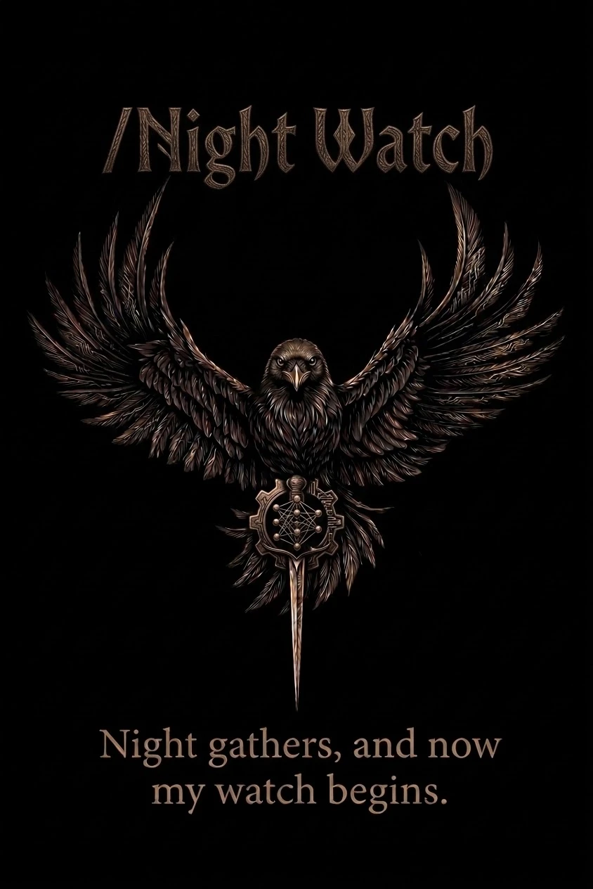

<div align="center">



**A Claude skill that runs a project in two shifts — one that needs you, and one that does not.**

Your attention is the scarce thing. Spend the day on the work only you can do, and hand the night a
queue that can run without you — and come back to something you can check, rather than something you
have to believe.

[Install](#install) · [The precondition](#the-one-precondition) · [How it works](#how-it-works) · [Falsification](#falsify-dont-just-test) · [The brief](#the-morning-brief) · [With Blindspot](#pairs-with-blindspot)

</div>

---

## The problem

You queue up work before bed. In the morning there are twelve commits, a cheerful summary, and every
test passing.

**And you have no way to tell whether any of it is real.**

That is not a hypothetical failure — it is the *normal* one. An unattended agent's worst outcome is
not a crash, which is obvious by morning. It is **plausible completion**: tests that cannot fail,
a guard satisfied by the comment explaining it, a number recalled instead of measured, hours spent
on a task that was closed last week. All of it looks exactly like success from the inside, and
nobody was awake to look from outside.

Night Watch is built around that one asymmetry. **It is not a scheduler.** It is the discipline that
makes unattended work falsifiable — and it starts by refusing to run where it cannot be.

## The one precondition

**A project with nothing that can fail loudly gets no benefit from this, and the skill says so
instead of running.**

```
gates     NONE FOUND

          A night shift on a project with no gate produces changes nobody can
          check. Do not arm one. Build the first gate instead — that is a good
          day's work, and it makes every night after it possible.
```

Tests, types, a build, a linter — something that goes red on its own. Without one, eight unattended
hours produce diffs indistinguishable from drift. **That refusal is the most valuable thing this
skill does**, and it is the reason to trust the rest of it.

## How it works

Three phases, split by **who is needed** — not by the clock.

| | **Day — plan** | **Night — run** | **Morning — brief** |
|:--|:--|:--|:--|
| **What happens** | sort the work by who it needs, retire the questions, write the queue | phases in order, one commit each, evidence per claim | every claim checked against git before anyone reads it |
| **Ends when** | the precondition check passes | the queue is done, blocked, or stopped cleanly | the numbers are measured or labelled unmeasured |
| **Refuses** | a queue that depends on an unanswered question | a decision on the never-decide list | a plausible figure in place of one it could not get |

### The day's real question

Not *what should we build*. **What would stop the night?**

Every candidate task goes in one of two columns, and the test is not difficulty — it is whether an
answer only you have would change what gets built.

| needs you | needs nobody |
|:--|:--|
| a decision between two designs | a decision already made, not yet done |
| taste, or how it should feel | a defect with a known correct behaviour |
| scope — is this in or out | a test for behaviour already specified |
| money, credentials, people | a refactor with a green gate on both sides |
| a preference nobody can infer | a measurement, and writing down what it says |

**Retire the left column while you are awake.** Everything moved from left to right is an hour of
night that will not be wasted. Anything that will not move does not enter the queue — it goes in the
brief as a question, with a default.

### Ordered by reversibility, not by interest

The shift may die at any phase. The question that matters is: *if it stops here, was what already
happened safe to have done?*

Additions and tests first. Refactors behind a green gate next. Anything touching shared state, live
services or another agent's lane **last, or not at all.**

### The check that refuses to arm

```
REFUSE  Phase 1 names T-999, which is not on the board at all. A shift that works an
        invented task looks productive the whole time.
REFUSE  Phase 2 has no gate. Name the exact command that proves it — a phase nothing can
        contradict is a phase nobody can check in the morning.
REFUSE  Phase 2 depends on something unanswered ('Decide later'). That is day work —
        retire it while they are awake, or drop the phase.
REFUSE  Phase 2 names T-637, which is already CLOSED. This is the failure this check
        exists for.

4 reason(s) this brief cannot run unattended.
A failing check is a finding, not a formality — fix the brief, do not override it.
```

Every one of those is a real failure that has happened to a real project, in the dark, while
reading as progress.

## Falsify, don't just test

**Writing a test proves you wrote a test.** The question is whether it can fail for the right
reason — and the only way to know is to make it fail.

So every guard the night writes gets broken on purpose, and **the break itself is checked**: a
mutation that changes nothing, or that stops the file parsing, proves nothing about the guard. Both
the mutation and its result go in the log.

These are all real, and all of them proved nothing:

| mutation | why it proved nothing |
|:--|:--|
| `if (false) return …` | the file stopped loading — red came from the parser, not the guard |
| `x if False else x` | evaluates to the original; nothing changed |
| a one-liner that truncated the file before reading it | the guard passed over an empty file |
| deleting a check nothing downstream reached | the defect never occurred |

The same discipline catches guards that are satisfied by the wrong thing — a test asserting a symbol
is *present* will happily match the comment explaining why it must not be.

## The morning brief

Run the verifier **before** writing a word of it:

```
claimed  2 · verified 1

THIS GOES AT THE TOP OF THE BRIEF:
  FAILED  deadbee  Phase 2 — claimed
          the sha does not exist in this repo

  ok      ec506e5c  Phase 1 — landed

  no sha in these log headings — they claim a phase and prove nothing:
          ### Phase 3 — no sha at all

  UNMEASURED: 2 of 3 phases logged, and no STOPPED marker.
  Cannot tell finished from interrupted — do not guess which.
```

**The sha goes in the log heading, never in prose**, and it is checked with
`git merge-base --is-ancestor` rather than `git cat-file`. A commit can exist and still not be in
your history — amended, rebased away, on a branch nobody merged. *Existence is not the question.*

On one real shift, ten shas were written into body text. The verifier found ten claims of completion
and could confirm none of them.

**And `UNMEASURED` is reported as unmeasured.** Loading, not-running, empty and not-knowing are four
different states; a brief that prints a plausible number for any of them has failed at the one thing
it exists to do.

The brief's shape is fixed, and its best section is the one nobody asked for:

1. Did the night deliver, and is anything on fire — **two lines**
2. A small table of numbers
3. What landed, each with a verified sha
4. **What was refused, and why** — with the measurement behind it
5. **Found and not chased** — what the shift noticed that was on nobody's list
6. What needs you — **capped at five**, each with the default if you say nothing

Section 5 earns its place. On one shift the single most valuable finding — a health check reporting a
dead service as healthy — was not on the queue at all. It surfaced only because the shift was told to
write down what it noticed.

## Pairs with Blindspot

**[Blindspot](https://github.com/IdanTayree/Blindspot)** interviews you one question at a time until
your unknowns run out, then harvests and verifies real open-source components. It answers *what are
we building*. Night Watch answers *how does it get built while you sleep*.

The seam between them is exact, and worth naming:

> **Blindspot's output is a list of decisions and a list of open questions — and open questions are
> precisely what must never enter a night queue.**

So a blueprint is the right input to a night shift, and its unresolved section is, by construction,
the next day's work. The decisions become phases; the verified components come with their licences
already checked, because **a night shift should never be choosing a dependency.**

Use Blindspot while the shape of the thing is still in question. Use Night Watch once it is not.

## Install

```bash
git clone https://github.com/IdanTayree/night-watch.git ~/.claude/skills/night-watch
```

Then say what you want done overnight. It triggers on things like *"work on this overnight"*,
*"queue up work for tonight"*, *"run while I'm out"* — and the morning after, on *"what happened
last night"* or *"the brief"*.

## Using the scripts on their own

No dependencies beyond Python 3.

```bash
python3 scripts/profile.py                       # what gates exist, and what is already running
python3 scripts/precheck.py brief.md             # refuse a brief that cannot run unattended
python3 scripts/verify_shift.py brief.md         # check the shift's claims against git
```

`profile.py` exits non-zero when a project has no gate — usable directly in CI as *"is this repo
safe to hand to an unattended agent?"*

## Layout

```
night-watch/
├── SKILL.md                  the three phases, and the precondition
├── references/
│   ├── planning.md           the day: profiling, sorting, phases, the never-decide list
│   ├── shift.md              the night: the loop, falsification, logging, stopping
│   └── brief.md              the morning: the fixed shape, and what may not be guessed
├── examples/
│   └── brief.md              a real armed brief, with its log
└── scripts/
    ├── profile.py            reads the repo — gates, boards, conventions, live ports
    ├── precheck.py           four checks per phase, plus the never-decide paths
    └── verify_shift.py       ancestry, not existence
```

## The mark

A tribute, and the right one: the oath on the poster belongs to the Night's Watch, who keep a watch
while everyone else sleeps — and the raven is Westeros's messenger, which is the other half of what
this skill does. It works overnight and it reports in the morning.

`assets/` carries three cuts of it: the poster (`night-watch.webp`, the README hero), a square
`avatar.png` with the caption cropped away for anywhere it renders small, and a 1280×640
`social-preview.png` for GitHub's social preview setting — which is web-only, under
*Settings → General → Social preview*.

## Licence

MIT — see [LICENSE](LICENSE).

<div align="center">

*Night gathers, and now my watch begins.*

</div>
